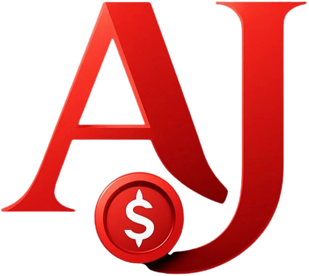

# AJ Money Makers - Digital Marketing Agency Website



A modern, responsive website for AJ Money Makers, a premier digital marketing agency based in Los Angeles, California.

## 🌟 About

AJ Money Makers is a digital marketing agency founded by Julian Rosario and Angie Rosso, dedicated to helping businesses thrive in the digital landscape through innovative marketing strategies.

## 📞 Contact Information

- **Location**: Los Angeles, California
- **Phone**: (559) 874-8874
- **Email**: info@ajmoneymakers.com

## ✨ Features

- **Modern Design**: Clean white theme with strategic red accents
- **Fully Responsive**: Works seamlessly on desktop, tablet, and mobile devices
- **Interactive Animations**: Smooth scrolling, fade-ins, and hover effects
- **Dynamic Logo**: Large, prominent branding (300px logo)
- **Animated Statistics**: Counters that animate when scrolled into view
- **Contact Form**: Functional form with validation
- **Service Showcase**: 6 comprehensive service offerings with interactive cards

## 🛠️ Technologies Used

- React.js
- CSS3 with modern animations
- Font Awesome icons
- Responsive design principles

## 🚀 Getting Started

### Prerequisites

- Node.js (v14 or higher)
- npm or yarn

### Installation

1. Clone the repository:
```bash
git clone https://github.com/jrose4502-ai/AJM.git
cd AJM
```

2. Install dependencies:
```bash
npm install
```

3. Start the development server:
```bash
npm start
```

The website will open at `http://localhost:3000`

### Build for Production

```bash
npm run build
```

This creates an optimized production build in the `build/` folder.

## 📁 Project Structure

```
website/
├── public/
│   └── index.html
├── src/
│   ├── assets/
│   │   └── images/
│   │       └── icon-transparent.png
│   ├── components/
│   │   ├── Navbar.js
│   │   ├── Hero.js
│   │   ├── About.js
│   │   ├── Services.js
│   │   ├── Contact.js
│   │   ├── Footer.js
│   │   └── ScrollToTop.js
│   ├── styles/
│   │   ├── Navbar.css
│   │   ├── Hero.css
│   │   ├── About.css
│   │   ├── Services.css
│   │   ├── Contact.css
│   │   ├── Footer.css
│   │   └── ScrollToTop.css
│   ├── App.js
│   ├── App.css
│   ├── index.js
│   └── index.css
└── package.json
```

## 🎨 Design Features

### Color Scheme
- **Primary**: White (#ffffff)
- **Accent**: Red (#dc2626)
- **Text**: Dark gray (#111827, #4b5563)
- **Backgrounds**: Light gray (#f9fafb)

### Sections
1. **Hero Section** - Eye-catching landing with dynamic gradient
2. **About Section** - Company information and founder profiles
3. **Services Section** - 6 service cards:
   - SEO Optimization
   - Social Media Marketing
   - PPC Advertising
   - Content Marketing
   - Analytics & Reporting
   - Web Development
4. **Contact Section** - Contact form and information cards
5. **Footer** - Links, contact info, and social media

## 👥 Team

- **Julian Rosario** - Co-Founder
- **Angie Rosso** - Co-Founder

## 📄 License

© 2025 AJ Money Makers. All rights reserved.

## 🤝 Contributing

This is a private company website. For inquiries, please contact us at info@ajmoneymakers.com

## 📧 Support

For support, email info@ajmoneymakers.com or call (559) 874-8874

---

Built with ❤️ by AJ Money Makers in Los Angeles, CA
